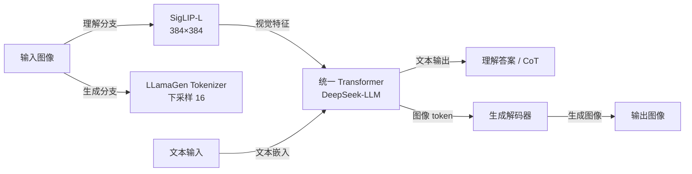
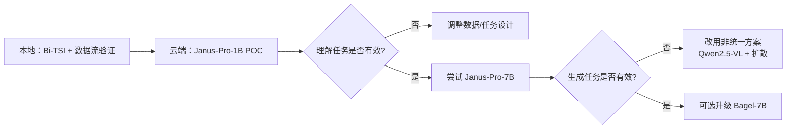

# Janus-Pro-7B 获取方式与微调可行性调研报告

> **调研目标**：评估 Janus-Pro-7B 作为 TimeOmni-VL backbone 替代方案的可行性，重点关注模型获取难度、硬件资源需求、微调路径与社区支持情况。  
> **调研时间**：2026-07-03  
> **核心结论**：Janus-Pro-7B 已完全开源，权重仅 14.8 GB（约为 Bagel-7B 的一半），推理与加载门槛显著低于 Bagel。但官方未提供训练脚本，社区微调方案目前主要支持理解任务，生成任务微调需自行实现。

---

## 1. 模型基本信息

| 项目 | Janus-Pro-7B | Janus-Pro-1B |
|---|---|---|
| **发布机构** | DeepSeek | DeepSeek |
| **论文** | Janus-Pro: Unified Multimodal Understanding and Generation with Data and Model Scaling (arXiv:2501.17811) | 同上 |
| **开源协议** | MIT（代码）/ DeepSeek Model License（模型） | 同上 |
| **Hugging Face** | https://huggingface.co/deepseek-ai/Janus-Pro-7B | https://huggingface.co/deepseek-ai/Janus-Pro-1B |
| **GitHub 仓库** | https://github.com/deepseek-ai/Janus | 同上 |
| **权重大小** | **14.8 GB** | 约 3-4 GB（推测） |
| **序列长度** | 4096 | 4096 |
| **架构** | 解耦视觉编码 + 统一 Transformer | 解耦视觉编码 + 统一 Transformer |
| **理解编码器** | SigLIP-L 384×384 | SigLIP-L 384×384 |
| **生成编码器** | LlamaGen tokenizer，下采样率 16 | LlamaGen tokenizer，下采样率 16 |
| **语言模型底座** | DeepSeek-LLM-7b-base | DeepSeek-LLM-1.5b-base |

---

## 2. 获取方式

### 2.1 模型权重下载

Janus-Pro-7B 权重托管在 Hugging Face，总大小约 **14.8 GB**，包含：

| 文件 | 大小 | 说明 |
|---|---|---|
| `pytorch_model-00001-of-00002.bin` | 9.99 GB | 模型权重分片 1 |
| `pytorch_model-00002-of-00002.bin` | 4.85 GB | 模型权重分片 2 |
| `pytorch_model.bin.index.json` | 89 kB | 分片索引 |
| `tokenizer.json` / `tokenizer_config.json` | ~5 MB | 分词器 |
| `config.json` / `preprocessor_config.json` / `processor_config.json` | 数 KB | 模型配置 |

**推荐下载方式**：

```python
from transformers import AutoModelForCausalLM

model_path = "deepseek-ai/Janus-Pro-7B"
vl_gpt = AutoModelForCausalLM.from_pretrained(
    model_path,
    trust_remote_code=True
)
```

或使用 `huggingface-cli`：

```bash
huggingface-cli download deepseek-ai/Janus-Pro-7B --local-dir ./models/Janus-Pro-7B
```

### 2.2 代码仓库下载

```bash
git clone https://github.com/deepseek-ai/Janus.git
cd Janus
pip install -e .
```

### 2.3 关键依赖

| 依赖 | 说明 |
|---|---|
| Python >= 3.8 | 官方推荐 |
| PyTorch + CUDA | GPU 推理/训练 |
| transformers | 核心依赖 |
| accelerate | 分布式训练 |
| timm | SigLIP 视觉编码器 |
| PIL / torchvision | 图像处理 |

> 与 Bagel 相比，Janus 不需要安装 `flash-attn`，环境配置更简单。

---

## 3. 模型架构与能力

### 3.1 架构特点

Janus-Pro 采用**解耦视觉编码**的统一架构：



核心优势：
- 理解与生成使用独立的视觉编码器，避免任务冲突；
- 统一 Transformer 处理两种模态，参数共享；
- 架构简单，仅基于 transformers 即可运行。

### 3.2 与 TimeOmni-VL 的适配度

| TimeOmni-VL 组件 | Janus-Pro 对应能力 | 适配难度 |
|---|---|---|
| TS-image 输入 | 通过 SigLIP 编码理解 | 低 |
| 理解 CoT 输出 | language_model.generate 文本生成 | 低 |
| 图像编辑/生成 | gen_head + gen_vision_model 自回归生成 | 中 |
| 交错训练 | 需自定义数据流，官方无现成方案 | 中 |
| 扩散去噪 | Janus-Pro 使用自回归生成，非扩散 | 中高 |

**关键差异**：TimeOmni-VL 使用 Bagel 的扩散模块进行图像生成，而 Janus-Pro 使用**自回归图像生成**（基于 VQ tokenizer）。若迁移到 Janus-Pro，生成任务需从扩散范式改为自回归范式，损失函数从 MSE 改为 CrossEntropy。

---

## 4. 推理方式

### 4.1 理解任务推理

```python
import torch
from transformers import AutoModelForCausalLM
from janus.models import MultiModalityCausalLM, VLChatProcessor
from janus.utils.io import load_pil_images

model_path = "deepseek-ai/Janus-Pro-7B"
vl_chat_processor = VLChatProcessor.from_pretrained(model_path)
tokenizer = vl_chat_processor.tokenizer

vl_gpt = AutoModelForCausalLM.from_pretrained(
    model_path, trust_remote_code=True
)
vl_gpt = vl_gpt.to(torch.bfloat16).cuda().eval()

conversation = [
    {
        "role": "<|User|>",
        "content": f"<image_placeholder>\n{question}",
        "images": [image],
    },
    {"role": "<|Assistant|>", "content": ""},
]

pil_images = load_pil_images(conversation)
prepare_inputs = vl_chat_processor(
    conversations=conversation,
    images=pil_images,
    force_batchify=True
).to(vl_gpt.device)

inputs_embeds = vl_gpt.prepare_inputs_embeds(**prepare_inputs)
outputs = vl_gpt.language_model.generate(
    inputs_embeds=inputs_embeds,
    attention_mask=prepare_inputs.attention_mask,
    pad_token_id=tokenizer.eos_token_id,
    bos_token_id=tokenizer.bos_token_id,
    eos_token_id=tokenizer.eos_token_id,
    max_new_tokens=512,
    do_sample=False,
    use_cache=True,
)
answer = tokenizer.decode(outputs[0].cpu().tolist(), skip_special_tokens=True)
```

### 4.2 生成任务推理

Janus-Pro 使用自回归方式生成图像 token，再通过 `gen_vision_model.decode_code` 解码为图像：

```python
# 关键步骤
logits = vl_gpt.gen_head(hidden_states[:, -1, :])
logit_cond = logits[0::2, :]
logit_uncond = logits[1::2, :]
logits = logit_uncond + cfg_weight * (logit_cond - logit_uncond)
probs = torch.softmax(logits / temperature, dim=-1)
next_token = torch.multinomial(probs, num_samples=1)
img_embeds = vl_gpt.prepare_gen_img_embeds(next_token)

dec = vl_gpt.gen_vision_model.decode_code(
    generated_tokens,
    shape=[parallel_size, 8, img_size//patch_size, img_size//patch_size]
)
```

### 4.3 关键超参数

| 参数 | 典型值 | 说明 |
|---|---|---|
| `temperature` | 1.0 | 生成多样性 |
| `cfg_weight` | 5.0 | Classifier-free guidance 强度 |
| `parallel_size` | 16 | 生成样本数量 |
| `image_token_num_per_image` | 576 | 每张图像的 token 数（384/16 = 24，24×24=576） |
| `img_size` | 384 | 生成图像尺寸 |
| `patch_size` | 16 | VQ tokenizer patch 大小 |

---

## 5. 微调可行性

### 5.1 官方支持情况

**官方未提供训练脚本**。GitHub 仓库仅包含推理代码（`inference.py`、`generation_inference.py`、`interactivechat.py`）和 Demo。

### 5.2 社区微调方案

#### 方案一：非官方理解任务微调（Issue #165）

社区用户提供了基于 `accelerate` 的理解任务微调代码示例：

```python
import torch
import torch.nn as nn
import torch.optim as optim
from transformers import AutoModelForCausalLM
from accelerate import Accelerator
from janus.models import MultiModalityCausalLM, VLChatProcessor
from janus.utils.io import load_pil_images

accelerator = Accelerator(mixed_precision="bf16")
device = accelerator.device

model_path = "deepseek-ai/Janus-1.3B"
vl_chat_processor = VLChatProcessor.from_pretrained(model_path)
tokenizer = vl_chat_processor.tokenizer

vl_gpt = AutoModelForCausalLM.from_pretrained(
    model_path, trust_remote_code=True
).to(device)
vl_gpt.train()

# 冻结 gen_embed 参数（生成相关）
for name, param in vl_gpt.named_parameters():
    if "gen_embed" in name:
        param.requires_grad = False

optimizer = optim.AdamW(
    vl_gpt.parameters(),
    lr=1e-4,
    betas=(0.9, 0.95),
    weight_decay=0.1
)
criterion = nn.CrossEntropyLoss(ignore_index=-100)
vl_gpt, optimizer = accelerator.prepare(vl_gpt, optimizer)
```

**特点**：
- 仅支持理解任务微调；
- 冻结 `gen_embed` 避免影响生成能力；
- 使用 `accelerate` 进行混合精度训练；
- 可作为 TimeOmni-VL 理解 CoT 训练的起点。

#### 方案二：基于 ms-swift 的微调（PR #189）

社区 PR 提供了使用 `ms-swift` 框架微调 Janus-Pro-7B 的方案：

```bash
# 示例命令（需参考 PR 具体文档）
swift sft \
  --model_type janus-pro-7b \
  --dataset your_dataset.jsonl \
  --max_length 2048 \
  --learning_rate 1e-4 \
  --lora_rank 8
```

**特点**：
- 支持 LoRA 高效微调；
- 主要面向理解任务；
- 作者反馈："Janus' fine-tuning doesn't support image generation"（PR 评论）。

### 5.3 生成任务微调挑战

Janus-Pro 的生成任务是**自回归离散 token 预测**，与 Bagel 的扩散生成不同：

| 方面 | Bagel（TimeOmni-VL 原生） | Janus-Pro |
|---|---|---|
| 生成方式 | 扩散去噪 | 自回归 token 生成 |
| 损失函数 | MSE（预测噪声） | CrossEntropy（预测下一个图像 token） |
| 条件输入 | 文本 + 源图像 | 文本 + 源图像 |
| 输出 | 连续 latent | 离散图像 token |
| 微调难度 | 需扩散训练经验 | 需 VQ-VAE / 自回归生成经验 |

**结论**：若使用 Janus-Pro 替代 Bagel，生成任务需重新设计训练逻辑，不能直接用 TimeOmni-VL 的扩散损失。

---

## 6. 硬件资源需求

### 6.1 推理资源

| 场景 | 显存需求 | 说明 |
|---|---|---|
| BF16 推理 | 16-20 GB | 单张 V100/A100 16GB 可能吃紧，推荐 24GB |
| FP16 推理 | 14-18 GB | 可尝试 16GB 显卡 |
| INT8 量化 | 10-12 GB | 社区有量化版本 |
| CPU 推理 | 不推荐 | 极慢 |

### 6.2 训练资源

| 场景 | 显存/硬件 | 说明 |
|---|---|---|
| 全参数微调 7B | 8×A100 40GB | 官方未提供脚本，需自行实现 |
| LoRA 微调 7B | 1×A100 40GB / 1×4090 24GB | 推荐，社区有 ms-swift 方案 |
| 全参数微调 1B | 1×A100 40GB / 1×V100 32GB | 资源要求大幅降低 |
| LoRA 微调 1B | 1×3090/4090 24GB | 适合个人/小团队 |

> **与 Bagel 对比**：Janus-Pro-7B 的推理和训练门槛均显著低于 Bagel-7B（Bagel 需要 22-32GB 推理，8×A100 全参数微调）。

---

## 7. 适配 TimeOmni-VL 的风险与建议

### 7.1 主要风险

| 风险 | 说明 | 建议 |
|---|---|---|
| 生成范式差异 | Janus-Pro 是自回归生成，非扩散 | 重新设计生成损失和训练流程 |
| 官方无训练脚本 | 需基于社区代码自行实现 | 先复现理解任务，再攻克生成任务 |
| 图像分辨率受限 | 生成固定 384×384，理解固定 384×384 | TS-image 需 resize 到 384×384，可能丢失高频细节 |
| 生成任务微调不成熟 | 社区反馈目前不支持生成微调 | 需深入研究 `gen_head` 和 `gen_vision_model` 的训练 |
| 图像 tokenizer 限制 | LlamaGen tokenizer 对 TS-image 数值精度不友好 | 需验证 I2TS 解码精度 |

### 7.2 分辨率适配问题

TimeOmni-VL 使用 896×896 TS-image，而 Janus-Pro：
- 理解分支：SigLIP 输入 384×384；
- 生成分支：输出 384×384。

这意味着：
- TS-image 必须被 resize 到 384×384，每个时间步的像素表示会大幅减少；
- 对于 96 点日周期，384 宽度下每个周期仅约 4 像素，可能不足以表达电价细节；
- 需要重新评估 Bi-TSI 容量约束：$W=384$ 时，$L <= 384 × 96 = 36,864$ 时点。

### 7.3 适配建议

1. **先用 Janus-Pro-1B 做 POC**：成本低，验证统一 UMM 是否适合电价预测；
2. **分阶段实现**：
   - 阶段 A：理解任务微调（有现成代码参考）；
   - 阶段 B：自回归生成任务训练（需自行实现）；
   - 阶段 C：理解 CoT 引导生成；
3. **调整 TS-image 分辨率**：将 896×896 降至 384×384 或 768×768（理解分支可接受多分辨率 resize）；
4. **保留 Bagel 作为最终目标**：Janus-Pro 用于快速验证，效果好后可迁移到 Bagel。

---

## 8. 与 Bagel-7B 的综合对比

| 维度 | Bagel-7B | Janus-Pro-7B | Janus-Pro-1B |
|---|---|---|---|
| **权重大小** | 29.6 GB | 14.8 GB | ~3-4 GB |
| **推理显存** | 22-32 GB | 16-24 GB | 8-12 GB |
| **全参数微调** | 8×A100 | 需自行实现 | 1×A100 |
| **LoRA 微调** | 可行但资料少 | 社区有 ms-swift 方案 | 非常容易 |
| **训练脚本** | 官方完整 | 官方无 | 官方无 |
| **生成方式** | 扩散 | 自回归 VQ | 自回归 VQ |
| **理解能力** | 强 | 强 | 中等 |
| **生成质量** | 强 | 较强 | 较弱 |
| **与 TimeOmni-VL 匹配度** | 极高 | 中 | 中 |
| **推荐度** | ★★★★★（最终目标） | ★★★★☆（折中方案） | ★★★★★（POC 首选） |

---

## 9. 推荐实施策略

考虑到本地无 GPU、训练资源有限、数据量仅 25 天，建议采用**分阶段、可回退**的策略：



### 推荐路径

| 阶段 | 模型 | 任务 | 目标 |
|---|---|---|---|
| POC | **Janus-Pro-1B** | 理解任务 | 验证 TS-image 可解释性 |
| 验证 | Janus-Pro-7B | 理解任务 | 提升理解精度 |
| 攻关 | Janus-Pro-7B | 自回归生成任务 | 实现理解引导生成 |
| 优化 | Bagel-7B | 扩散生成任务 | 若资源允许，回归论文原生方案 |

---

## 10. 结论

1. **Janus-Pro-7B 是 Bagel-7B 的可行替代方案**，权重更小、环境依赖更少、推理门槛更低。
2. **主要代价是生成范式不同**：从扩散改为自回归，需要重新实现生成训练逻辑。
3. **社区微调支持理解任务较成熟**，生成任务微调仍处于探索阶段。
4. **建议从 Janus-Pro-1B 开始 POC**，成本低、迭代快，验证核心思路后再决定是否升级。
5. **最终若追求最佳效果**，仍建议回归 Bagel-7B 或等 Janus 后续版本完善训练方案。

---

## 11. 参考链接

- Janus-Pro 论文：https://arxiv.org/abs/2501.17811
- Janus 论文：https://arxiv.org/abs/2410.13848
- 模型 7B：https://huggingface.co/deepseek-ai/Janus-Pro-7B
- 模型 1B：https://huggingface.co/deepseek-ai/Janus-Pro-1B
- 代码：https://github.com/deepseek-ai/Janus
- 理解微调示例：https://github.com/deepseek-ai/Janus/issues/165
- ms-swift 微调 PR：https://github.com/deepseek-ai/Janus/pull/189
- Demo：https://huggingface.co/spaces/deepseek-ai/Janus-Pro-7B
