# TimeOmni-VL 用户侧日前出清电价预测 — 架构设计文档

> **文档定位**：基于《需求分析_用户侧日前电价预测.md》的后续设计，定义系统整体结构、模块职责、数据流与接口规范。  
> **核心原则**：backbone 模型可插拔，当前阶段不绑定 Bagel-7B 或 Janus-Pro-7B 等具体实现。  
> **版本**：v1.0  
> **生成时间**：2026-07-03

---

## 1. 设计目标

### 1.1 总体目标

构建一个面向用户侧日前出清电价预测的端到端系统，复现 TimeOmni-VL 的核心思想：

- **Bi-TSI 双向映射**：将多变量时间序列编码为高保真 TS-image；
- **理解任务**：让模型从 TS-image 中解析出电价相关语义；
- **理解引导生成**：利用理解 CoT 作为条件，生成未来电价 TS-image；
- **数值解码**：通过 I2TS 将生成图像还原为电价预测序列。

### 1.2 设计原则

| 原则 | 说明 |
|---|---|
| **Backbone 可插拔** | 通过抽象接口适配不同 UMM（Bagel、Janus、Qwen-VL + Diffusion 等） |
| **数据驱动配置** | 超参数（周期、分辨率、变量数）由数据自动推导 |
| **本地可验证** | 无 GPU 环境下可跑通数据流和模型前向 mock |
| **云端可扩展** | 训练脚本支持单机/多机、单卡/多卡、不同显存容量自适应 |
| **阶段解耦** | Bi-TSI、理解任务、生成任务可独立开发、独立验证 |

---

## 2. 总体架构

### 2.1 分层架构

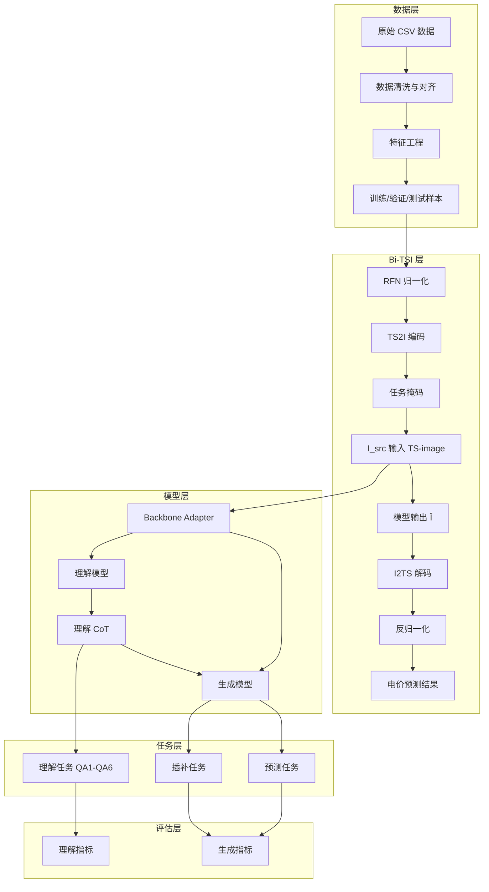

### 2.2 模块职责

| 模块 | 职责 |
|---|---|
| 数据层 | 读取 41 个 CSV，清洗、对齐、构造滚动窗口样本 |
| Bi-TSI 层 | 时间序列 ⇔ 图像的高保真双向转换 |
| 模型层 | 提供统一接口，屏蔽不同 backbone 的实现差异 |
| 任务层 | 实现理解 QA、预测、插补三类任务 |
| 训练层 | 联合训练理解 CoT 与生成能力 |
| 推理层 | 支持理解答案输出与电价预测输出 |
| 评估层 | 计算理解指标与生成指标，输出可视化 |

---

## 3. 数据层架构

### 3.1 数据流

```mermaid
flowchart LR
    Raw[41 个 CSV] --> Loader[CSV Loader]
    Loader --> Aligner[日期对齐器]
    Aligner --> Cleaner[缺失值处理]
    Cleaner --> Featurizer[特征工程]
    Featurizer --> Splitter[时序划分]
    Splitter --> Sampler[滚动窗口采样]
    Sampler --> Samples[(context, target) 样本]
```

### 3.2 核心组件

#### 3.2.1 CSV Loader

- 递归读取 `Dataset/` 下所有 CSV；
- 解析前 9 列元信息，识别 `ID`、`数据类型`、`数据地区`、`日期` 等；
- 将后 97 列时点数据展平为 (日期, 时点, 值) 长表格式。

#### 3.2.2 日期对齐器

- 以目标变量（统一结算点电价临时结果）的日期范围为基准；
- 对其他文件按日期截断，缺失日期标记为 NaN；
- 统一去除 24:00 列，保留每天 96 个时点。

#### 3.2.3 缺失值处理

| 策略 | 适用场景 |
|---|---|
| 前向填充 | 短期缺失，如个别时点 |
| 线性插值 | 连续少量缺失 |
| 全天填充 | 整天缺失，使用相邻日均值 |
| 删除变量 | 训练期间全缺失或缺失率 > 50% |

#### 3.2.4 特征工程

| 特征类型 | 说明 |
|---|---|
| 原始数值特征 | 各变量 15 分钟粒度序列 |
| 日历特征 | 小时、星期、是否周末、是否节假日 |
| 滞后特征 | 前 1/2/7 天同一时点值 |
| 统计特征 | 日内均值/标准差/最值 |
| 差分特征 | 一阶差分、周期差分 |

#### 3.2.5 滚动窗口采样

```
输入：T 天历史
输出：(X_ctx, X_tgt) 样本对

短期预测：ctx=7天，tgt=1天
长期预测：ctx=14天，tgt=3天
```

---

## 4. Bi-TSI 层架构

### 4.1 TS2I 编码器

```mermaid
flowchart LR
    X[多变量序列 X∈ℝ^{T×N}] --> RFN[RFN 归一化]
    RFN --> Fold[周期折叠 S^{n}∈ℝ^{f×C}]
    Fold --> Render[条带渲染]
    Render --> Stack[垂直堆叠]
    Stack --> Color[颜色分配]
    Color --> Mask[任务掩码]
    Mask --> I[TS-image I_src]
```

### 4.2 I2TS 解码器

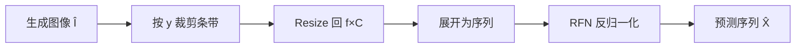

### 4.3 关键配置参数

| 参数 | 说明 | 推荐值 |
|---|---|---|
| `frequency` | 周期长度 | 96（15 分钟日周期） |
| `image_size` | TS-image 分辨率 | 896×896（优先）/ 448×448 / 384×384 |
| `max_variables` | 最大变量数 | 由容量约束自动计算 |
| `context_days` | 历史天数 | 7（短期）/ 14（长期） |
| `forecast_days` | 预测天数 | 1（短期）/ 3（长期） |

### 4.4 容量约束

```
H / N >= f
W >= L / f
```

若约束不满足，系统自动：
1. 提升 `image_size`；
2. 或按优先级剔除低重要性变量；
3. 或减少 `context_days`。

---

## 5. 模型层架构（Backbone 可插拔）

### 5.1 抽象接口设计

核心接口：`BackboneAdapter`

```python
class BackboneAdapter(ABC):
    @abstractmethod
    def load(self, model_path: str, device: str): ...

    @abstractmethod
    def understand(self, image: Image.Image, prompt: str) -> str: ...

    @abstractmethod
    def generate(self, source_image: Image.Image, prompt: str, cot: str) -> Image.Image: ...

    @abstractmethod
    def train_step(self, batch: dict) -> dict: ...

    @abstractmethod
    def save_checkpoint(self, path: str): ...

    @abstractmethod
    def load_checkpoint(self, path: str): ...
```

### 5.2 适配器实现规划

| 适配器 | 说明 | 状态 |
|---|---|---|
| `BagelAdapter` | 适配 Bagel-7B-MoT | 规划中 |
| `JanusAdapter` | 适配 Janus-Pro-1B/7B | 规划中 |
| `MockAdapter` | CPU 本地验证用，输出占位结果 | 优先实现 |
| `QwenVLAdapter` | 理解用 Qwen2.5-VL，生成用外部扩散模型 | 备选 |

### 5.3 模型层数据流

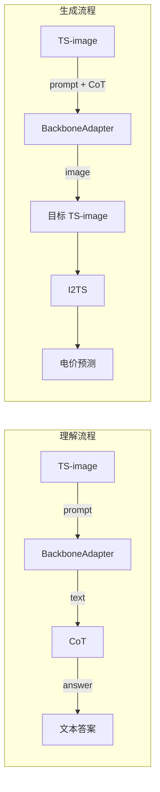

---

## 6. 任务层架构

### 6.1 理解任务

| 任务 ID | 任务名称 | 输入 | 输出 |
|---|---|---|---|
| QA1 | 变量计数 | TS-image | 整数 |
| QA2 | 变量 Y 范围 | TS-image + 变量索引 | y 区间 |
| QA3 | 周期边界框 | TS-image + 变量/周期索引 | bbox |
| QA4 | 峰谷比较 | TS-image + 两个周期 |  brighter 周期索引 |
| QA5 | 异常检测 | TS-image + 变量 | 异常周期列表 |
| QA6 | 趋势分析 | TS-image + 变量/周期 | 颜色、bbox、文本描述 |

### 6.2 生成任务

| 任务 | 输入 | 输出 | 掩码位置 |
|---|---|---|---|
| 日前电价预测 | 历史 TS-image + 生成指令 | 未来电价 TS-image | 右侧 |
| 电价插补 | 完整 TS-image + 生成指令 | 补全后 TS-image | 随机位置 |

### 6.3 任务数据格式

#### 理解样本

```json
{
  "image": "path/to/ts_image.png",
  "task": "understanding",
  "question": "Which variable uses the red band?",
  "cot": "The topmost band is red and corresponds to the electricity price variable.",
  "answer": "Variable 1 (electricity price)."
}
```

#### 生成样本

```json
{
  "source_image": "path/to/src.png",
  "target_image": "path/to/tgt.png",
  "task": "forecasting",
  "instruction": "Predict the next day's electricity price.",
  "cot": "1) Variable Counting: ... 2) Pattern: ... 3) Forecast: ..."
}
```

---

## 7. 训练层架构

### 7.1 训练目标

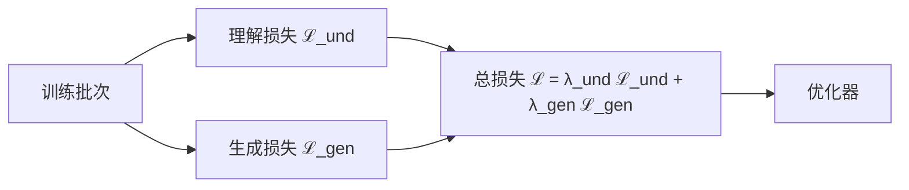

### 7.2 损失函数

| 任务 | 损失 | 说明 |
|---|---|---|
| 理解 | CrossEntropy | 文本 CoT 与答案的 next-token prediction |
| 生成 | MSE / CrossEntropy | 具体取决于 backbone：扩散用 MSE，自回归用 CE |

### 7.3 训练流程

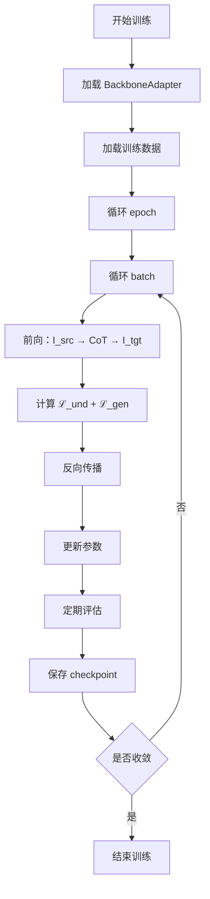

### 7.4 训练配置管理

使用 YAML 统一管理：

```yaml
model:
  backbone: "mock"  # bagel / janus / mock / qwen_vl
  model_path: null
  device: "auto"    # auto / cuda / cpu

data:
  frequency: 96
  image_size: 896
  context_days: 7
  forecast_days: 1
  train_ratio: 0.7
  val_ratio: 0.15
  test_ratio: 0.15

training:
  lr: 3e-5
  batch_size: 1
  num_epochs: 100
  warmup_ratio: 0.05
  lambda_und: 1.0
  lambda_gen: 1.0
  gradient_accumulation_steps: 4
  mixed_precision: "bf16"
  lora:
    enabled: true
    rank: 8
    alpha: 16
    target_modules: ["q_proj", "v_proj"]
```

---

## 8. 推理层架构

### 8.1 理解推理

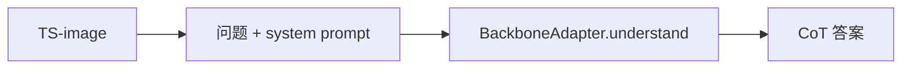

### 8.2 生成推理

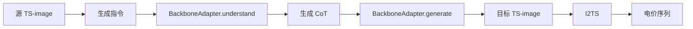

### 8.3 推理模式

| 模式 | 说明 | 用途 |
|---|---|---|
| **End-to-end** | 理解 CoT + 生成一次性完成 | 生产环境 |
| **理解 only** | 仅输出 CoT，不生成 | 调试与可解释性分析 |
| **生成 only** | 直接生成，无 CoT 引导 | 消融实验 |
| **CoT-conditioned** | 使用给定 CoT 生成 | 控制实验 |

---

## 9. 评估层架构

### 9.1 理解评估

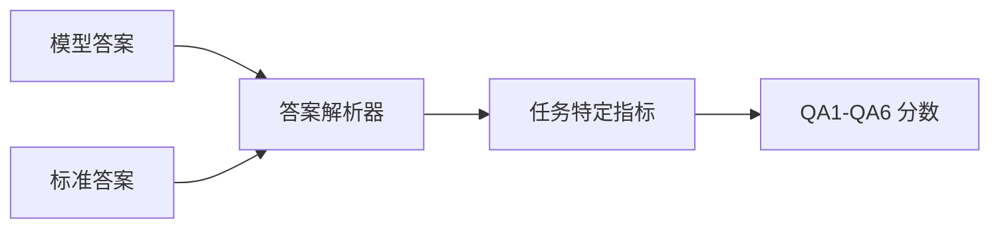

### 9.2 生成评估

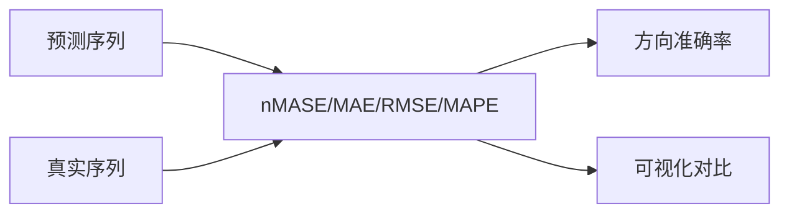

---

## 10. 接口设计

### 10.1 核心类图

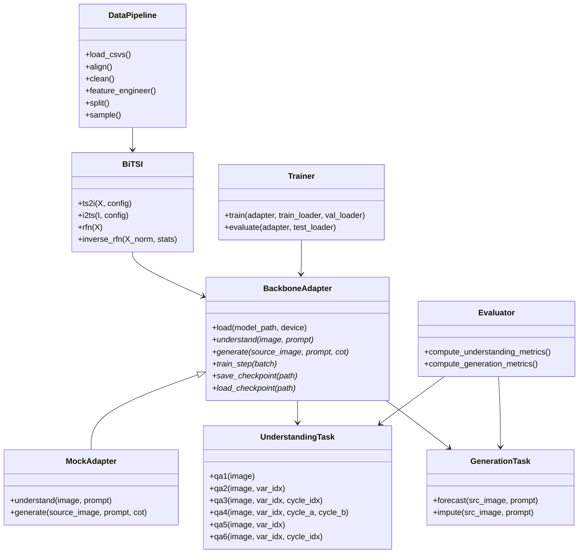

### 10.2 命令行接口

```bash
# 数据预处理
python -m timeomni_vl.data.prepare --config configs/data.yaml

# Bi-TSI 验证
python -m timeomni_vl.bitsi.validate --config configs/bitsi.yaml

# 训练
python -m timeomni_vl.train --config configs/train.yaml

# 理解推理
python -m timeomni_vl.infer.understand --image path.png --question "..."

# 生成推理
python -m timeomni_vl.infer.generate --image path.png --instruction "..." --output pred.npy

# 评估
python -m timeomni_vl.eval --config configs/eval.yaml
```

---

## 11. 部署架构

### 11.1 本地开发环境

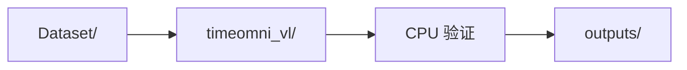

### 11.2 云端训练环境

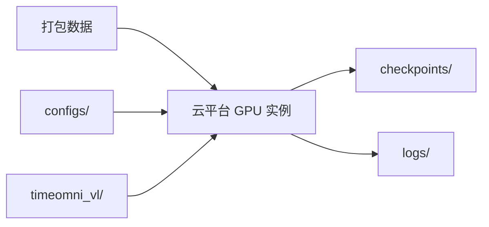

### 11.3 生产推理环境

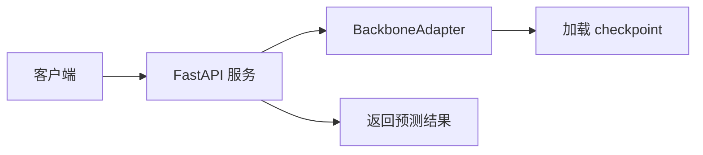

---

## 12. 关键数据结构与配置

### 12.1 项目目录结构

```
TimeOmni-VL/
├── configs/                    # 配置文件
│   ├── data.yaml
│   ├── bitsi.yaml
│   ├── train.yaml
│   └── eval.yaml
├── data/                       # 处理后数据
│   ├── raw/                    # 原始 CSV
│   ├── processed/              # 清洗后数据
│   └── samples/                # 训练样本
├── docs/                       # 文档
├── models/                     # 下载的 backbone 权重
├── outputs/                    # 输出结果
│   ├── checkpoints/
│   ├── logs/
│   ├── images/
│   └── predictions/
├── timeomni_vl/                # 主代码
│   ├── data/                   # 数据层
│   ├── bitsi/                  # Bi-TSI 层
│   ├── models/                 # 模型层与适配器
│   ├── tasks/                  # 任务层
│   ├── training/               # 训练层
│   ├── inference/              # 推理层
│   ├── evaluation/             # 评估层
│   └── utils/                  # 工具函数
├── scripts/                    # 脚本
│   ├── prepare_data.sh
│   ├── train.sh
│   └── eval.sh
├── tests/                      # 单元测试
├── requirements.txt
└── README.md
```

### 12.2 核心配置项

| 配置项 | 类型 | 默认值 | 说明 |
|---|---|---|---|
| `model.backbone` | str | `"mock"` | backbone 类型 |
| `data.frequency` | int | `96` | 日周期点数 |
| `data.image_size` | int | `896` | TS-image 尺寸 |
| `data.context_days` | int | `7` | 短期历史天数 |
| `data.forecast_days` | int | `1` | 短期预测天数 |
| `training.lr` | float | `3e-5` | 学习率 |
| `training.lora.enabled` | bool | `true` | 是否启用 LoRA |

---

## 13. 风险与应对

| 风险 | 影响 | 应对 |
|---|---|---|
| Backbone 未最终确定 | 训练代码需兼容多种实现 | 通过 `BackboneAdapter` 接口隔离 |
| 数据量小 | 过拟合 | 滚动窗口、插补任务、数据增强 |
| 分辨率限制 | TS-image 信息丢失 | 支持多分辨率自动选择 |
| 云端环境不确定 | 脚本可能不兼容 | 提供 CPU mock 和 GPU 自适应脚本 |
| 生成精度不足 | 电价预测不准 | 理解 CoT + 多分辨率 + 消融实验 |

---

## 14. 下一步工作

1. **实现数据层**：CSV 读取、对齐、清洗、特征工程；
2. **实现 Bi-TSI**：RFN、TS2I、I2TS、保真度验证；
3. **实现 MockAdapter**：本地无 GPU 验证完整数据流；
4. **构造理解 QA**：基于电价领域设计 QA1-QA6；
5. **实现训练框架**：联合训练理解与生成任务；
6. **实现评估与可视化**：指标计算与结果展示。

---

## 15. 参考文档

- 《需求分析_用户侧日前电价预测.md》
- 《Bagel-7B获取方式与可行性调研.md》
- 《Janus-Pro-7B获取方式与微调可行性调研.md》
- TimeOmni-VL 论文（arXiv:2602.17149）
