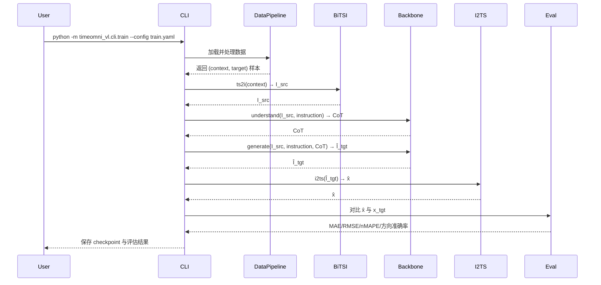

# TimeOmni-VL 用户侧日前出清电价预测 — 详细设计文档

> **文档定位**：在《架构设计文档.md》基础上，细化各模块的类、函数、方法、接口与数据流。  
> **目标读者**：参与实现的开发人员。  
> **版本**：v1.0  
> **生成时间**：2026-07-03

---

## 1. 设计约定

### 1.1 命名规范

| 类别 | 规范 | 示例 |
|---|---|---|
| 模块/包 | 小写，下划线分隔 | `data_pipeline`, `bitsi` |
| 类 | 大驼峰 | `BackboneAdapter`, `TS2IConverter` |
| 函数/方法 | 小写，下划线分隔 | `load_csvs()`, `ts2i()` |
| 常量 | 大写，下划线分隔 | `DEFAULT_FREQUENCY = 96` |
| 私有方法 | 单下划线前缀 | `_normalize()` |
| 配置文件 | 小写，YAML 格式 | `data.yaml`, `train.yaml` |

### 1.2 类型注解

所有公共函数必须包含类型注解：

```python
from typing import Dict, List, Tuple, Optional, Union, Any
import numpy as np
import pandas as pd
from PIL import Image

def ts2i(
    x: np.ndarray,
    frequency: int,
    image_size: int,
    stats: Optional[Dict[str, np.ndarray]] = None,
) -> Tuple[Image.Image, Dict[str, np.ndarray]]:
    ...
```

### 1.3 异常处理

- 所有 I/O 操作需捕获并包装为 `TimeOmniVLError` 子类；
- 使用 `logging` 模块记录，不直接 `print`；
- 关键步骤抛出可恢复异常，允许上层降级。

---

## 2. 项目目录与模块结构

```
timeomni_vl/
├── __init__.py                 # 包版本与全局常量
├── config.py                   # 配置解析与管理
├── logger.py                   # 日志工具
├── exceptions.py               # 自定义异常
├── data/                       # 数据层
│   ├── __init__.py
│   ├── loader.py               # CSV 加载
│   ├── aligner.py              # 日期对齐
│   ├── cleaner.py              # 缺失值处理
│   ├── featurizer.py           # 特征工程
│   ├── splitter.py             # 数据集划分
│   └── sampler.py              # 滚动窗口采样
├── bitsi/                      # Bi-TSI 层
│   ├── __init__.py
│   ├── rfn.py                  # Robust Fidelity Normalization
│   ├── ts2i.py                 # Time Series to Image
│   ├── i2ts.py                 # Image to Time Series
│   ├── renderer.py             # 图像渲染
│   └── validator.py            # round-trip 验证
├── tasks/                      # 任务层
│   ├── __init__.py
│   ├── understanding.py        # 理解任务生成与评估
│   └── generation.py           # 生成任务生成与评估
├── models/                     # 模型层
│   ├── __init__.py
│   ├── adapter.py              # BackboneAdapter 抽象接口
│   ├── mock_adapter.py         # Mock 适配器
│   ├── bagel_adapter.py        # Bagel 适配器
│   └── janus_adapter.py        # Janus 适配器
├── training/                   # 训练层
│   ├── __init__.py
│   ├── trainer.py              # 训练器
│   ├── collator.py             # 数据整理
│   └── scheduler.py            # 学习率调度
├── inference/                  # 推理层
│   ├── __init__.py
│   ├── understanding.py        # 理解推理
│   └── generation.py           # 生成推理
├── evaluation/                 # 评估层
│   ├── __init__.py
│   ├── understanding_metrics.py
│   └── generation_metrics.py
└── utils/                      # 工具
    ├── __init__.py
    ├── image.py                # 图像工具
    ├── text.py                 # 文本工具
    └── io.py                   # I/O 工具
```

---

## 3. 全局模块

### 3.1 `timeomni_vl/__init__.py`

```python
__version__ = "0.1.0"

DEFAULT_FREQUENCY = 96
DEFAULT_IMAGE_SIZE = 896
DEFAULT_CONTEXT_DAYS = 7
DEFAULT_FORECAST_DAYS = 1
DEFAULT_SHORT_HORIZON = 1
DEFAULT_LONG_HORIZON = 3
```

### 3.2 `timeomni_vl/exceptions.py`

```python
class TimeOmniVLError(Exception):
    """Base exception."""
    pass

class DataLoadError(TimeOmniVLError):
    """数据加载异常。"""
    pass

class DataAlignmentError(TimeOmniVLError):
    """数据对齐异常。"""
    pass

class BiTSIError(TimeOmniVLError):
    """Bi-TSI 转换异常。"""
    pass

class BackboneError(TimeOmniVLError):
    """Backbone 模型异常。"""
    pass

class TrainingError(TimeOmniVLError):
    """训练异常。"""
    pass

class InferenceError(TimeOmniVLError):
    """推理异常。"""
    pass
```

### 3.3 `timeomni_vl/logger.py`

```python
import logging
import sys

def get_logger(name: str, level: int = logging.INFO) -> logging.Logger:
    """获取配置好的 logger。"""
    logger = logging.getLogger(name)
    logger.setLevel(level)
    if not logger.handlers:
        handler = logging.StreamHandler(sys.stdout)
        formatter = logging.Formatter(
            "%(asctime)s - %(name)s - %(levelname)s - %(message)s"
        )
        handler.setFormatter(formatter)
        logger.addHandler(handler)
    return logger
```

### 3.4 `timeomni_vl/config.py`

```python
from dataclasses import dataclass, field
from typing import Dict, List, Optional, Any
import yaml
from pathlib import Path

@dataclass
class DataConfig:
    raw_data_dir: str
    output_dir: str
    frequency: int = 96
    points_per_day: int = 96
    context_days: int = 7
    forecast_days: int = 1
    long_context_days: int = 14
    long_forecast_days: int = 3
    target_variable: str = "统一结算点电价临时结果"
    train_ratio: float = 0.7
    val_ratio: float = 0.15
    test_ratio: float = 0.15
    missing_threshold: float = 0.5
    selected_variables: Optional[List[str]] = None
    calendar_features: bool = True

@dataclass
class BiTSIConfig:
    image_size: int = 896
    alpha: float = 0.5
    c_mad: float = 0.6745
    kappa: float = 4.0
    color_map: Dict[str, str] = field(default_factory=dict)
    max_variables: Optional[int] = None

@dataclass
class ModelConfig:
    backbone: str = "mock"  # mock / bagel / janus / qwen_vl
    model_path: Optional[str] = None
    device: str = "auto"  # auto / cuda / cpu
    dtype: str = "bfloat16"

@dataclass
class TrainingConfig:
    lr: float = 3e-5
    batch_size: int = 1
    num_epochs: int = 100
    warmup_ratio: float = 0.05
    lambda_und: float = 1.0
    lambda_gen: float = 1.0
    gradient_accumulation_steps: int = 4
    mixed_precision: str = "bf16"
    max_grad_norm: float = 1.0
    save_every: int = 500
    eval_every: int = 100
    lora_enabled: bool = True
    lora_rank: int = 8
    lora_alpha: int = 16
    lora_target_modules: List[str] = field(default_factory=lambda: ["q_proj", "v_proj"])

@dataclass
class EvalConfig:
    metrics: List[str] = field(default_factory=lambda: ["mae", "rmse", "nmape", "direction"])
    visualize: bool = True
    num_samples: int = 10

class ConfigManager:
    """配置管理器。"""

    def __init__(self, config_path: str):
        self.config_path = Path(config_path)
        self.raw = self._load_yaml()

    def _load_yaml(self) -> Dict[str, Any]:
        with open(self.config_path, "r", encoding="utf-8") as f:
            return yaml.safe_load(f)

    def get_data_config(self) -> DataConfig:
        return DataConfig(**self.raw.get("data", {}))

    def get_bitsi_config(self) -> BiTSIConfig:
        return BiTSIConfig(**self.raw.get("bitsi", {}))

    def get_model_config(self) -> ModelConfig:
        return ModelConfig(**self.raw.get("model", {}))

    def get_training_config(self) -> TrainingConfig:
        return TrainingConfig(**self.raw.get("training", {}))

    def get_eval_config(self) -> EvalConfig:
        return EvalConfig(**self.raw.get("eval", {}))
```

---

## 4. 数据层

### 4.1 `timeomni_vl/data/loader.py`

```python
from pathlib import Path
from typing import Dict, List, Optional
import pandas as pd
import numpy as np
from timeomni_vl.exceptions import DataLoadError
from timeomni_vl.logger import get_logger

logger = get_logger(__name__)

class CSVLoader:
    """递归加载 Dataset/ 目录下所有 CSV 文件。"""

    def __init__(self, data_dir: str, encoding: str = "utf-8"):
        self.data_dir = Path(data_dir)
        self.encoding = encoding

    def load_all(self) -> Dict[str, pd.DataFrame]:
        """
        加载所有 CSV 文件。

        Returns:
            Dict[str, pd.DataFrame]: key 为相对路径，value 为 DataFrame。
        """
        ...

    def load_single(self, file_path: Path) -> pd.DataFrame:
        """加载单个 CSV 文件。"""
        ...

    def _validate_columns(self, df: pd.DataFrame, file_path: Path) -> None:
        """验证列结构：前 9 列为元信息，后 97 列为时点列。"""
        ...
```

### 4.2 `timeomni_vl/data/aligner.py`

```python
from typing import Dict, List
import pandas as pd
from timeomni_vl.exceptions import DataAlignmentError

class DateAligner:
    """按日期对齐所有数据文件。"""

    def __init__(self, frequency: int = 96):
        self.frequency = frequency

    def align(
        self,
        data_dict: Dict[str, pd.DataFrame],
        target_key: str,
    ) -> pd.DataFrame:
        """
        以目标变量为基准，对齐所有变量。

        Args:
            data_dict: 所有加载的 DataFrame。
            target_key: 目标变量对应的 key。

        Returns:
            pd.DataFrame: 宽表，列为 [date, time_idx, var1, var2, ...]。
        """
        ...

    def _parse_date_column(self, df: pd.DataFrame) -> pd.DataFrame:
        """解析日期列，生成 datetime 索引。"""
        ...

    def _reshape_to_long(
        self,
        df: pd.DataFrame,
        var_name: str,
    ) -> pd.DataFrame:
        """将宽表（97 列时点）转为长表。"""
        ...
```

### 4.3 `timeomni_vl/data/cleaner.py`

```python
from typing import Dict, List
import pandas as pd
import numpy as np

class DataCleaner:
    """缺失值处理与异常值清洗。"""

    def __init__(
        self,
        missing_threshold: float = 0.5,
        method: str = "mixed",
    ):
        self.missing_threshold = missing_threshold
        self.method = method

    def clean(self, df: pd.DataFrame) -> pd.DataFrame:
        """清洗数据，返回处理后的 DataFrame。"""
        ...

    def drop_high_missing_variables(
        self,
        df: pd.DataFrame,
    ) -> pd.DataFrame:
        """删除缺失率过高的变量。"""
        ...

    def fill_missing(
        self,
        df: pd.DataFrame,
        method: str = "mixed",
    ) -> pd.DataFrame:
        """
        填充缺失值。

        method:
            - forward: 前向填充
            - linear: 线性插值
            - daily: 相邻日同时点均值
            - mixed: 综合策略
        """
        ...

    def detect_outliers(
        self,
        series: pd.Series,
        method: str = "iqr",
    ) -> pd.Series:
        """异常值检测，返回布尔 mask。"""
        ...
```

### 4.4 `timeomni_vl/data/featurizer.py`

```python
from typing import List, Optional
import pandas as pd
import numpy as np

class Featurizer:
    """特征工程。"""

    def __init__(self, frequency: int = 96):
        self.frequency = frequency

    def transform(self, df: pd.DataFrame) -> pd.DataFrame:
        """应用全部特征工程。"""
        ...

    def add_calendar_features(self, df: pd.DataFrame) -> pd.DataFrame:
        """添加小时、星期、是否周末等特征。"""
        ...

    def add_lag_features(
        self,
        df: pd.DataFrame,
        lags: List[int] = [1, 2, 7],
    ) -> pd.DataFrame:
        """添加滞后特征。"""
        ...

    def add_rolling_stats(
        self,
        df: pd.DataFrame,
        windows: List[int] = [96, 96 * 7],
    ) -> pd.DataFrame:
        """添加滚动统计特征。"""
        ...

    def add_diff_features(self, df: pd.DataFrame) -> pd.DataFrame:
        """添加差分特征。"""
        ...
```

### 4.5 `timeomni_vl/data/splitter.py`

```python
from dataclasses import dataclass
from typing import Tuple
import pandas as pd
import numpy as np

@dataclass
class SplitResult:
    train: pd.DataFrame
    val: pd.DataFrame
    test: pd.DataFrame

class TimeSeriesSplitter:
    """按时间顺序划分训练/验证/测试集。"""

    def __init__(
        self,
        train_ratio: float = 0.7,
        val_ratio: float = 0.15,
        test_ratio: float = 0.15,
    ):
        self.train_ratio = train_ratio
        self.val_ratio = val_ratio
        self.test_ratio = test_ratio

    def split(self, df: pd.DataFrame) -> SplitResult:
        """按日期顺序划分。"""
        ...

    def split_by_date(
        self,
        df: pd.DataFrame,
        train_end: str,
        val_end: str,
    ) -> SplitResult:
        """按指定日期划分。"""
        ...
```

### 4.6 `timeomni_vl/data/sampler.py`

```python
from dataclasses import dataclass
from typing import List, Tuple, Optional
import pandas as pd
import numpy as np

@dataclass
class Sample:
    """单个训练样本。"""
    context: np.ndarray           # (context_len, n_vars)
    target: np.ndarray            # (target_len, n_vars) 或 (target_len,)
    metadata: dict
    task: str                     # "forecasting" / "imputation"

class RollingWindowSampler:
    """滚动窗口采样器。"""

    def __init__(
        self,
        context_length: int,
        target_length: int,
        stride: int = 1,
        task: str = "forecasting",
        imputation_mask_ratio: Tuple[float, float] = (0.1, 0.5),
    ):
        self.context_length = context_length
        self.target_length = target_length
        self.stride = stride
        self.task = task
        self.imputation_mask_ratio = imputation_mask_ratio

    def sample(
        self,
        df: pd.DataFrame,
        target_var: str,
    ) -> List[Sample]:
        """生成样本列表。"""
        ...

    def _create_forecast_sample(
        self,
        values: np.ndarray,
        start_idx: int,
        target_var_idx: int,
    ) -> Sample:
        """构造预测样本。"""
        ...

    def _create_imputation_sample(
        self,
        values: np.ndarray,
        start_idx: int,
        target_var_idx: int,
    ) -> Sample:
        """构造插补样本。"""
        ...
```

---

## 5. Bi-TSI 层

### 5.1 `timeomni_vl/bitsi/rfn.py`

```python
from typing import Dict, Tuple, Optional
import numpy as np

class RobustFidelityNormalizer:
    """Robust Fidelity Normalization。"""

    def __init__(
        self,
        alpha: float = 0.5,
        c_mad: float = 0.6745,
        kappa: float = 4.0,
    ):
        self.alpha = alpha
        self.c_mad = c_mad
        self.kappa = kappa

    def fit_transform(
        self,
        x: np.ndarray,
    ) -> Tuple[np.ndarray, Dict[str, np.ndarray]]:
        """
        拟合并转换数据。

        Args:
            x: (T, N) 多变量时间序列。

        Returns:
            x_norm: (T, N) 归一化后序列，值域约 [-1, 1]。
            stats: 包含 mu, sigma 的字典，用于反归一化。
        """
        ...

    def inverse_transform(
        self,
        x_norm: np.ndarray,
        stats: Dict[str, np.ndarray],
    ) -> np.ndarray:
        """反归一化。"""
        ...

    def _compute_sigma(self, x: np.ndarray, mu: np.ndarray) -> np.ndarray:
        """计算混合缩放因子。"""
        ...
```

### 5.2 `timeomni_vl/bitsi/ts2i.py`

```python
from typing import Dict, List, Tuple, Optional
import numpy as np
from PIL import Image

class TS2IConverter:
    """Time Series to Image 转换器。"""

    def __init__(
        self,
        frequency: int,
        image_size: int,
        color_map: Optional[Dict[str, str]] = None,
    ):
        self.frequency = frequency
        self.image_size = image_size
        self.color_map = color_map or self._default_color_map()

    def convert(
        self,
        x: np.ndarray,
        mask: Optional[np.ndarray] = None,
        task: str = "forecasting",
    ) -> Image.Image:
        """
        将时间序列转换为 TS-image。

        Args:
            x: (T, N) 归一化后的多变量序列。
            mask: (T,) 或 (T, N) 掩码，True 表示需预测/插补区域。
            task: "forecasting" 或 "imputation"。

        Returns:
            TS-image PIL.Image。
        """
        ...

    def _fold_to_grid(
        self,
        x: np.ndarray,
    ) -> np.ndarray:
        """
        将序列按周期折叠为网格。

        Args:
            x: (T, N)。

        Returns:
            grids: (N, f, C)。
        """
        ...

    def _render_bands(
        self,
        grids: np.ndarray,
        band_height: int,
    ) -> np.ndarray:
        """将每个变量网格渲染为条带。"""
        ...

    def _apply_mask(
        self,
        image_array: np.ndarray,
        mask: np.ndarray,
        task: str,
    ) -> np.ndarray:
        """根据任务应用掩码。"""
        ...

    def _default_color_map(self) -> Dict[str, str]:
        """默认颜色映射。"""
        ...
```

### 5.3 `timeomni_vl/bitsi/i2ts.py`

```python
from typing import Dict, Tuple
import numpy as np
from PIL import Image

class I2TSConverter:
    """Image to Time Series 转换器。"""

    def __init__(
        self,
        frequency: int,
        image_size: int,
    ):
        self.frequency = frequency
        self.image_size = image_size

    def convert(
        self,
        image: Image.Image,
        n_vars: int,
        target_length: int,
        stats: Dict[str, np.ndarray],
        task: str = "forecasting",
    ) -> np.ndarray:
        """
        将生成图像解码为时间序列。

        Args:
            image: 生成或补全后的 TS-image。
            n_vars: 变量数。
            target_length: 目标序列长度。
            stats: RFN 统计量。
            task: "forecasting" 或 "imputation"。

        Returns:
            x_hat: (target_length, n_vars) 或 (target_length,) 预测序列。
        """
        ...

    def _extract_bands(
        self,
        image_array: np.ndarray,
        n_vars: int,
    ) -> np.ndarray:
        """按 y 位置提取变量条带。"""
        ...

    def _resize_to_grid(
        self,
        band: np.ndarray,
    ) -> np.ndarray:
        """Resize 回 f×C 网格。"""
        ...

    def _unfold_grid(
        self,
        grid: np.ndarray,
        target_length: int,
    ) -> np.ndarray:
        """展开为时间序列。"""
        ...
```

### 5.4 `timeomni_vl/bitsi/renderer.py`

```python
from typing import Tuple
import numpy as np
from PIL import Image

class ImageRenderer:
    """TS-image 渲染工具。"""

    @staticmethod
    def grayscale_to_rgb(
        grid: np.ndarray,
        color: Tuple[int, int, int],
    ) -> np.ndarray:
        """将单通道网格渲染为指定 RGB 颜色。"""
        ...

    @staticmethod
    def resize_band(
        band: np.ndarray,
        height: int,
        width: int,
    ) -> np.ndarray:
        """Resize 条带。"""
        ...

    @staticmethod
    def assemble_image(
        bands: np.ndarray,
    ) -> Image.Image:
        """垂直堆叠条带并返回 PIL Image。"""
        ...
```

### 5.5 `timeomni_vl/bitsi/validator.py`

```python
from typing import Dict
import numpy as np
from PIL import Image

class BiTSIValidator:
    """Bi-TSI round-trip 验证器。"""

    def __init__(
        self,
        rfn,
        ts2i,
        i2ts,
    ):
        self.rfn = rfn
        self.ts2i = ts2i
        self.i2ts = i2ts

    def validate(
        self,
        x: np.ndarray,
        task: str = "forecasting",
    ) -> Dict[str, float]:
        """
        验证 round-trip 误差。

        Returns:
            {"mae": float, "rmse": float, "max_error": float}
        """
        ...
```

---

## 6. 任务层

### 6.1 `timeomni_vl/tasks/understanding.py`

```python
from typing import Dict, List, Tuple, Any
import numpy as np
from PIL import Image

class UnderstandingTaskGenerator:
    """理解任务样本生成器。"""

    def __init__(
        self,
        frequency: int,
        image_size: int,
    ):
        self.frequency = frequency
        self.image_size = image_size

    def generate_all(
        self,
        sample,
    ) -> List[Dict[str, Any]]:
        """为单个样本生成 6 类理解 QA。"""
        ...

    def qa1_variable_counting(
        self,
        n_vars: int,
    ) -> Dict[str, Any]:
        """变量计数。"""
        ...

    def qa2_variable_y_range(
        self,
        var_idx: int,
        n_vars: int,
    ) -> Dict[str, Any]:
        """变量 Y 范围。"""
        ...

    def qa3_cycle_bounding_box(
        self,
        var_idx: int,
        cycle_idx: int,
        total_cycles: int,
    ) -> Dict[str, Any]:
        """周期边界框。"""
        ...

    def qa4_mean_comparison(
        self,
        var_idx: int,
        cycle_a: int,
        cycle_b: int,
        values: np.ndarray,
    ) -> Dict[str, Any]:
        """峰谷比较。"""
        ...

    def qa5_anomaly_detection(
        self,
        var_idx: int,
        values: np.ndarray,
        threshold: float = 18.0,
    ) -> Dict[str, Any]:
        """异常检测。"""
        ...

    def qa6_trend_analysis(
        self,
        var_idx: int,
        cycle_idx: int,
        values: np.ndarray,
    ) -> Dict[str, Any]:
        """趋势分析。"""
        ...

class UnderstandingEvaluator:
    """理解任务评估器。"""

    def __init__(self):
        self.scorers = {
            "qa1": self.exact_match,
            "qa2": self.iou_score,
            "qa3": self.iou_score,
            "qa4": self.exact_match,
            "qa5": self.weighted_accuracy,
            "qa6": self.composite_qa6,
        }

    def evaluate(
        self,
        predictions: List[Dict[str, Any]],
        references: List[Dict[str, Any]],
    ) -> Dict[str, float]:
        """评估所有理解任务。"""
        ...

    def exact_match(self, pred: Any, ref: Any) -> float:
        ...

    def iou_score(self, pred: Any, ref: Any) -> float:
        ...

    def weighted_accuracy(self, pred: Any, ref: Any) -> float:
        ...

    def composite_qa6(self, pred: Any, ref: Any) -> float:
        ...
```

### 6.2 `timeomni_vl/tasks/generation.py`

```python
from typing import Dict, List, Any
import numpy as np
from PIL import Image

class GenerationTaskGenerator:
    """生成任务样本生成器。"""

    def __init__(
        self,
        frequency: int,
        context_days: int,
        forecast_days: int,
    ):
        self.frequency = frequency
        self.context_days = context_days
        self.forecast_days = forecast_days

    def generate_cot(
        self,
        understanding_qas: List[Dict[str, Any]],
    ) -> str:
        """
        将理解 QA 组合为生成 CoT。

        Args:
            understanding_qas: 同一实例的 6 类 QA。

        Returns:
            生成 CoT 文本。
        """
        ...

    def build_interleaved_sequence(
        self,
        source_image: Image.Image,
        target_image: Image.Image,
        instruction: str,
        cot: str,
    ) -> Dict[str, Any]:
        """
        构建交错训练序列。

        Returns:
            {"system": str, "image_src": Image, "instruction": str, "cot": str, "image_tgt": Image}
        """
        ...

class GenerationEvaluator:
    """生成任务评估器。"""

    def __init__(self, metrics: List[str] = None):
        self.metrics = metrics or ["mae", "rmse", "nmape", "direction"]

    def evaluate(
        self,
        predictions: np.ndarray,
        references: np.ndarray,
    ) -> Dict[str, float]:
        """评估生成结果。"""
        ...

    def mae(self, pred: np.ndarray, ref: np.ndarray) -> float:
        ...

    def rmse(self, pred: np.ndarray, ref: np.ndarray) -> float:
        ...

    def nmape(self, pred: np.ndarray, ref: np.ndarray) -> float:
        ...

    def direction_accuracy(self, pred: np.ndarray, ref: np.ndarray) -> float:
        ...
```

---

## 7. 模型层

### 7.1 `timeomni_vl/models/adapter.py`

```python
from abc import ABC, abstractmethod
from typing import Dict, Any, Optional
from PIL import Image

class BackboneAdapter(ABC):
    """Backbone 模型抽象接口。"""

    @abstractmethod
    def load(self, model_path: Optional[str], device: str, **kwargs) -> None:
        """加载模型。"""
        ...

    @abstractmethod
    def understand(
        self,
        image: Image.Image,
        prompt: str,
        system_prompt: Optional[str] = None,
        max_new_tokens: int = 512,
        temperature: float = 0.3,
    ) -> str:
        """
        理解任务推理。

        Args:
            image: 输入 TS-image。
            prompt: 问题文本。
            system_prompt: 系统提示。
            max_new_tokens: 最大生成 token 数。
            temperature: 采样温度。

        Returns:
            模型输出文本（含 CoT）。
        """
        ...

    @abstractmethod
    def generate(
        self,
        source_image: Image.Image,
        prompt: str,
        cot: Optional[str] = None,
        image_size: Tuple[int, int] = (896, 896),
        num_inference_steps: int = 50,
        guidance_scale: float = 5.0,
    ) -> Image.Image:
        """
        生成任务推理。

        Args:
            source_image: 源 TS-image。
            prompt: 生成指令。
            cot: 生成 CoT（可选）。
            image_size: 输出图像尺寸。
            num_inference_steps: 推理步数。
            guidance_scale: CFG 强度。

        Returns:
            生成的 TS-image。
        """
        ...

    @abstractmethod
    def train_step(self, batch: Dict[str, Any]) -> Dict[str, float]:
        """训练一步，返回损失字典。"""
        ...

    @abstractmethod
    def save_checkpoint(self, path: str) -> None:
        """保存 checkpoint。"""
        ...

    @abstractmethod
    def load_checkpoint(self, path: str) -> None:
        """加载 checkpoint。"""
        ...

    @abstractmethod
    def get_trainable_params(self) -> Dict[str, Any]:
        """返回可训练参数信息。"""
        ...
```

### 7.2 `timeomni_vl/models/mock_adapter.py`

```python
import random
from typing import Dict, Any, Optional, Tuple
from PIL import Image
from timeomni_vl.models.adapter import BackboneAdapter

class MockAdapter(BackboneAdapter):
    """本地 CPU 验证用的 Mock 适配器。"""

    def __init__(self):
        self.loaded = False

    def load(self, model_path: Optional[str], device: str, **kwargs) -> None:
        self.loaded = True

    def understand(
        self,
        image: Image.Image,
        prompt: str,
        system_prompt: Optional[str] = None,
        max_new_tokens: int = 512,
        temperature: float = 0.3,
    ) -> str:
        return "<think>Mock reasoning</think> Mock answer."

    def generate(
        self,
        source_image: Image.Image,
        prompt: str,
        cot: Optional[str] = None,
        image_size: Tuple[int, int] = (896, 896),
        num_inference_steps: int = 50,
        guidance_scale: float = 5.0,
    ) -> Image.Image:
        return Image.new("RGB", image_size, color=(128, 128, 128))

    def train_step(self, batch: Dict[str, Any]) -> Dict[str, float]:
        return {"loss_und": 0.5, "loss_gen": 0.3, "loss_total": 0.8}

    def save_checkpoint(self, path: str) -> None:
        pass

    def load_checkpoint(self, path: str) -> None:
        pass

    def get_trainable_params(self) -> Dict[str, Any]:
        return {}
```

### 7.3 `timeomni_vl/models/bagel_adapter.py`

```python
from typing import Dict, Any, Optional, Tuple
from PIL import Image
from timeomni_vl.models.adapter import BackboneAdapter

class BagelAdapter(BackboneAdapter):
    """Bagel-7B 适配器。"""

    def __init__(self):
        self.model = None
        self.tokenizer = None
        self.vae_model = None
        self.inferencer = None

    def load(self, model_path: Optional[str], device: str, **kwargs) -> None:
        """加载 Bagel-7B 权重与推理器。"""
        ...

    def understand(self, image, prompt, **kwargs) -> str:
        ...

    def generate(self, source_image, prompt, cot=None, **kwargs) -> Image.Image:
        ...

    def train_step(self, batch: Dict[str, Any]) -> Dict[str, float]:
        ...

    def save_checkpoint(self, path: str) -> None:
        ...

    def load_checkpoint(self, path: str) -> None:
        ...

    def get_trainable_params(self) -> Dict[str, Any]:
        ...
```

### 7.4 `timeomni_vl/models/janus_adapter.py`

```python
from typing import Dict, Any, Optional, Tuple
from PIL import Image
from timeomni_vl.models.adapter import BackboneAdapter

class JanusAdapter(BackboneAdapter):
    """Janus-Pro 适配器。"""

    def __init__(self):
        self.vl_gpt = None
        self.processor = None
        self.tokenizer = None

    def load(self, model_path: Optional[str], device: str, **kwargs) -> None:
        """加载 Janus-Pro 权重。"""
        ...

    def understand(self, image, prompt, **kwargs) -> str:
        ...

    def generate(self, source_image, prompt, cot=None, **kwargs) -> Image.Image:
        ...

    def train_step(self, batch: Dict[str, Any]) -> Dict[str, float]:
        ...

    def save_checkpoint(self, path: str) -> None:
        ...

    def load_checkpoint(self, path: str) -> None:
        ...

    def get_trainable_params(self) -> Dict[str, Any]:
        ...
```

### 7.5 `timeomni_vl/models/__init__.py`

```python
from timeomni_vl.models.adapter import BackboneAdapter
from timeomni_vl.models.mock_adapter import MockAdapter
from timeomni_vl.models.bagel_adapter import BagelAdapter
from timeomni_vl.models.janus_adapter import JanusAdapter

ADAPTER_REGISTRY = {
    "mock": MockAdapter,
    "bagel": BagelAdapter,
    "janus": JanusAdapter,
}

def build_adapter(backbone: str) -> BackboneAdapter:
    if backbone not in ADAPTER_REGISTRY:
        raise ValueError(f"Unknown backbone: {backbone}")
    return ADAPTER_REGISTRY[backbone]()
```

---

## 8. 训练层

### 8.1 `timeomni_vl/training/collator.py`

```python
from typing import Dict, List, Any
from PIL import Image

class TSUMMCollator:
    """TSUMM-Suite 数据整理器。"""

    def __init__(self, processor):
        self.processor = processor

    def __call__(self, batch: List[Dict[str, Any]]) -> Dict[str, Any]:
        """
        将样本列表整理为模型输入。

        Args:
            batch: 样本列表。

        Returns:
            整理后的 batch，包含 images, input_ids, attention_mask, labels 等。
        """
        ...
```

### 8.2 `timeomni_vl/training/trainer.py`

```python
from typing import Dict, Any, Optional
from pathlib import Path
import torch
from torch.utils.data import DataLoader
from timeomni_vl.models.adapter import BackboneAdapter
from timeomni_vl.config import TrainingConfig

class TSUMMTrainer:
    """TimeOmni-VL 训练器。"""

    def __init__(
        self,
        adapter: BackboneAdapter,
        train_loader: DataLoader,
        val_loader: Optional[DataLoader],
        config: TrainingConfig,
        output_dir: str,
    ):
        self.adapter = adapter
        self.train_loader = train_loader
        self.val_loader = val_loader
        self.config = config
        self.output_dir = Path(output_dir)
        self.global_step = 0

    def train(self) -> Dict[str, Any]:
        """执行训练循环。"""
        ...

    def _train_epoch(self, epoch: int) -> Dict[str, float]:
        """训练一个 epoch。"""
        ...

    def _validate(self) -> Dict[str, float]:
        """验证。"""
        ...

    def _save_checkpoint(self, epoch: int) -> None:
        """保存 checkpoint。"""
        ...

    def _log_metrics(self, metrics: Dict[str, float]) -> None:
        """记录指标。"""
        ...
```

### 8.3 `timeomni_vl/training/scheduler.py`

```python
from torch.optim.lr_scheduler import _LRScheduler

class WarmupCosineScheduler(_LRScheduler):
    """带 warmup 的余弦退火学习率调度器。"""

    def __init__(
        self,
        optimizer,
        warmup_steps: int,
        total_steps: int,
        min_lr: float = 0.0,
    ):
        ...

    def get_lr(self):
        ...
```

---

## 9. 推理层

### 9.1 `timeomni_vl/inference/understanding.py`

```python
from typing import Dict, Any
from PIL import Image
from timeomni_vl.models.adapter import BackboneAdapter

class UnderstandingInferencer:
    """理解任务推理器。"""

    def __init__(
        self,
        adapter: BackboneAdapter,
        system_prompt: str = None,
    ):
        self.adapter = adapter
        self.system_prompt = system_prompt or self._default_prompt()

    def infer(
        self,
        image: Image.Image,
        question: str,
    ) -> Dict[str, str]:
        """
        执行理解推理。

        Returns:
            {"raw": str, "cot": str, "answer": str}
        """
        ...

    def _extract_cot(self, text: str) -> str:
        """从 <think> 标签中提取 CoT。"""
        ...

    def _extract_answer(self, text: str) -> str:
        """提取最终答案。"""
        ...
```

### 9.2 `timeomni_vl/inference/generation.py`

```python
from typing import Dict, Any, Optional
from PIL import Image
import numpy as np
from timeomni_vl.models.adapter import BackboneAdapter
from timeomni_vl.bitsi.i2ts import I2TSConverter

class GenerationInferencer:
    """生成任务推理器。"""

    def __init__(
        self,
        adapter: BackboneAdapter,
        i2ts_converter: I2TSConverter,
        use_cot: bool = True,
    ):
        self.adapter = adapter
        self.i2ts = i2ts_converter
        self.use_cot = use_cot

    def forecast(
        self,
        source_image: Image.Image,
        instruction: str,
        n_vars: int,
        target_length: int,
        stats: Dict[str, np.ndarray],
    ) -> Dict[str, Any]:
        """
        执行预测推理。

        Returns:
            {
                "cot": str,
                "generated_image": Image.Image,
                "predicted_values": np.ndarray,
            }
        """
        ...

    def impute(
        self,
        source_image: Image.Image,
        instruction: str,
        n_vars: int,
        target_length: int,
        stats: Dict[str, np.ndarray],
    ) -> Dict[str, Any]:
        """执行插补推理。"""
        ...
```

---

## 10. 评估层

### 10.1 `timeomni_vl/evaluation/understanding_metrics.py`

```python
from typing import Any, Dict, List

class UnderstandingMetrics:
    """理解任务指标。"""

    @staticmethod
    def exact_match(pred: Any, ref: Any) -> float:
        ...

    @staticmethod
    def iou(pred_box: List[int], ref_box: List[int]) -> float:
        ...

    @staticmethod
    def weighted_accuracy(pred: Dict, ref: Dict) -> float:
        ...

    @staticmethod
    def bert_score(pred_text: str, ref_text: str) -> float:
        ...
```

### 10.2 `timeomni_vl/evaluation/generation_metrics.py`

```python
import numpy as np
from typing import Dict

class GenerationMetrics:
    """生成任务指标。"""

    @staticmethod
    def mae(pred: np.ndarray, ref: np.ndarray) -> float:
        ...

    @staticmethod
    def rmse(pred: np.ndarray, ref: np.ndarray) -> float:
        ...

    @staticmethod
    def nmape(pred: np.ndarray, ref: np.ndarray) -> float:
        """归一化 MAPE。"""
        ...

    @staticmethod
    def direction_accuracy(pred: np.ndarray, ref: np.ndarray) -> float:
        ...

    @staticmethod
    def nmae(pred: np.ndarray, ref: np.ndarray) -> float:
        """归一化 MAE。"""
        ...
```

---

## 11. 工具模块

### 11.1 `timeomni_vl/utils/image.py`

```python
from PIL import Image
import numpy as np

def normalize_image(image: Image.Image) -> np.ndarray:
    """PIL Image 转 [0, 1] numpy 数组。"""
    ...

def denormalize_image(arr: np.ndarray) -> Image.Image:
    """[0, 1] numpy 数组转 PIL Image。"""
    ...

def resize_image(
    image: Image.Image,
    size: Tuple[int, int],
) -> Image.Image:
    ...
```

### 11.2 `timeomni_vl/utils/text.py`

```python
import re

def extract_between_tags(text: str, tag: str = "think") -> str:
    """提取 <tag>...</tag> 之间的内容。"""
    ...

def format_price(value: float, decimals: int = 2) -> str:
    """格式化电价数值。"""
    ...
```

### 11.3 `timeomni_vl/utils/io.py`

```python
import json
from pathlib import Path
from typing import Any, Dict, List

def save_json(data: Any, path: str) -> None:
    ...

def load_json(path: str) -> Any:
    ...

def ensure_dir(path: str) -> Path:
    ...
```

---

## 12. CLI 入口

### 12.1 `timeomni_vl/cli/prepare_data.py`

```python
import argparse
from timeomni_vl.config import ConfigManager
from timeomni_vl.data.pipeline import build_data_pipeline

def main():
    parser = argparse.ArgumentParser()
    parser.add_argument("--config", required=True)
    args = parser.parse_args()

    config = ConfigManager(args.config).get_data_config()
    pipeline = build_data_pipeline(config)
    pipeline.run()

if __name__ == "__main__":
    main()
```

### 12.2 `timeomni_vl/cli/train.py`

```python
import argparse
from timeomni_vl.config import ConfigManager
from timeomni_vl.models import build_adapter
from timeomni_vl.training.trainer import TSUMMTrainer

def main():
    parser = argparse.ArgumentParser()
    parser.add_argument("--config", required=True)
    args = parser.parse_args()

    cfg = ConfigManager(args.config)
    adapter = build_adapter(cfg.get_model_config().backbone)
    adapter.load(
        cfg.get_model_config().model_path,
        cfg.get_model_config().device,
    )
    # ... 加载数据、构造 trainer、训练

if __name__ == "__main__":
    main()
```

### 12.3 `timeomni_vl/cli/infer.py`

```python
import argparse
from timeomni_vl.config import ConfigManager
from timeomni_vl.models import build_adapter

def main():
    parser = argparse.ArgumentParser()
    parser.add_argument("--config", required=True)
    parser.add_argument("--image", required=True)
    parser.add_argument("--task", choices=["understand", "forecast", "impute"])
    parser.add_argument("--prompt", required=True)
    args = parser.parse_args()

    cfg = ConfigManager(args.config).get_model_config()
    adapter = build_adapter(cfg.backbone)
    adapter.load(cfg.model_path, cfg.device)
    # ... 执行推理

if __name__ == "__main__":
    main()
```

---

## 13. 配置文件示例

### 13.1 `configs/data.yaml`

```yaml
data:
  raw_data_dir: "Dataset"
  output_dir: "data/processed"
  frequency: 96
  context_days: 7
  forecast_days: 1
  long_context_days: 14
  long_forecast_days: 3
  target_variable: "统一结算点电价临时结果"
  train_ratio: 0.7
  val_ratio: 0.15
  test_ratio: 0.15
  missing_threshold: 0.5
  calendar_features: true
```

### 13.2 `configs/train.yaml`

```yaml
model:
  backbone: "mock"
  model_path: null
  device: "auto"
  dtype: "bfloat16"

bitsi:
  image_size: 896
  alpha: 0.5
  c_mad: 0.6745
  kappa: 4.0

training:
  lr: 3e-5
  batch_size: 1
  num_epochs: 100
  warmup_ratio: 0.05
  lambda_und: 1.0
  lambda_gen: 1.0
  gradient_accumulation_steps: 4
  mixed_precision: "bf16"
  max_grad_norm: 1.0
  save_every: 500
  eval_every: 100
  lora_enabled: true
  lora_rank: 8
  lora_alpha: 16
  lora_target_modules: ["q_proj", "v_proj"]
```

---

## 14. 数据流完整示例



---

## 15. 单元测试设计

### 15.1 测试模块结构

```
tests/
├── __init__.py
├── test_data.py
├── test_bitsi.py
├── test_tasks.py
├── test_models.py
├── test_training.py
├── test_inference.py
└── test_evaluation.py
```

### 15.2 关键测试用例

| 模块 | 测试用例 |
|---|---|
| data | CSV 加载、日期对齐、缺失值填充、滚动窗口采样 |
| bitsi | RFN round-trip、TS2I 形状、I2TS round-trip、容量约束检查 |
| tasks | QA 生成、CoT 组合、指标计算 |
| models | MockAdapter 接口、Bagel/Janus 适配器加载（可选） |
| training | collator、trainer 单步、scheduler |
| inference | 理解推理解析、生成推理解码 |
| evaluation | MAE/RMSE/nMAPE/方向准确率 |

---

## 16. 下一步开发计划

1. **搭建项目骨架**：创建所有模块目录和 `__init__.py`；
2. **实现全局模块**：`config.py`、`logger.py`、`exceptions.py`；
3. **实现数据层**：从 `loader.py` 到 `sampler.py`；
4. **实现 Bi-TSI 层**：RFN、TS2I、I2TS、validator；
5. **实现 MockAdapter**：验证完整数据流；
6. **实现理解任务生成器与评估器**；
7. **实现训练框架**：collator、trainer、scheduler；
8. **实现推理与评估入口**；
9. **编写单元测试**；
10. **接入真实 backbone**：Bagel 或 Janus。

---

## 17. 参考文档

- 《需求分析_用户侧日前电价预测.md》
- 《架构设计文档.md》
- 《Bagel-7B获取方式与可行性调研.md》
- 《Janus-Pro-7B获取方式与微调可行性调研.md》
- TimeOmni-VL 论文（arXiv:2602.17149）
