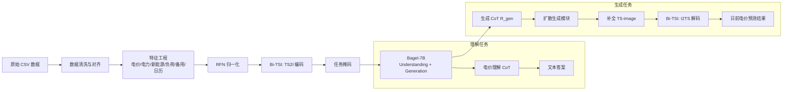

# TimeOmni-VL 在用户侧日前出清电价预测中的复现 — 需求分析文档

> **论文**：TimeOmni-VL: Unified Models for Time Series Understanding and Generation  
> **arXiv**：2602.17149v2 (ICML 2026)  
> **复现场景**：用户侧日前出清电价预测  
> **数据基础**：Dataset/ 目录下 41 个 CSV 文件  
> **文档版本**：v1.0  
> **生成时间**：2026-07-03

---

## 1. 项目背景与业务目标

### 1.1 业务背景

电力现货市场中，**日前出清电价（Day-ahead Market Clearing Price）** 是用户侧主体（售电公司、分布式储能、负荷聚合商）进行日前交易决策的核心依据。准确预测日前电价能够帮助市场主体：

- 优化储能充放电策略；
- 制定日前购电/售电计划；
- 降低偏差考核成本；
- 规避高电价时段风险，捕捉负电价套利机会。

### 1.2 技术目标

本项目基于论文 **TimeOmni-VL: Unified Models for Time Series Understanding and Generation**（ICML 2026），将其视觉中心统一建模思想迁移到用户侧日前出清电价预测场景。目标包括：

- **Bi-TSI 双向映射**：将多变量电价相关序列编码为 TS-image；
- **TSUMM-Suite 式任务设计**：构造电价领域理解与生成任务；
- **Understanding-Guided Generation**：用理解 CoT 指导电价预测生成；
- **多变量联合预测**：以日前出清电价为单目标，联合多个相关变量共同建模。

---

## 2. 问题定义

### 2.1 输入与输出

**输入**：

- 历史多变量时间序列 $X \in \mathbb{R}^{T \times N}$；
- 时间粒度：15 分钟，每天 96 个有效时点（00:00 至 23:45，去除 24:00 重复列）；
- 目标变量：**统一结算点电价临时结果**（即日前出清电价）；
- 协变量包括：
  - 用户侧日前出清电力；
  - 储能发电计划（地区汇总/江北/江南，预发布/终发布）；
  - 受电计划（华东，边界/出清）；
  - 实际受电情况；
  - 实际系统负荷、短期系统负荷预测；
  - 统调光电/风电功率预测与实际风光；
  - 分省可再生能源发电能力预测；
  - 正负备用空间；
  - 燃机固定出力总值；
  - 时间/日历特征。

**输出**：

- **短期预测**：未来 1 天，96 个时点；
- **长期预测**：未来 3 天，288 个时点；
- 输出形式为 TS-image 中补全的掩码区域，经 I2TS 解码后恢复为数值序列。

### 2.2 任务形式

| 任务类型 | 形式 | 说明 |
|---|---|---|
| 生成任务 | 预测（Forecasting） | 给定历史序列，预测未来出清电价 |
| 生成任务 | 插补（Imputation） | 模拟部分电价缺失，补全曲线 |
| 理解任务 | 电价模式理解 | 峰值/谷值/负电价/周期性定位与描述 |
| 推理任务 | 趋势/异常/价格区间判断 | 文本答案 + 数值输出 |

### 2.3 评估指标

| 指标 | 用途 | 说明 |
|---|---|---|
| MAE | 数值精度 | 平均绝对误差 |
| RMSE | 数值精度 | 均方根误差，惩罚大误差 |
| nMASE | 归一化误差 | 与 Naive 预测对比，论文主要指标 |
| MAPE | 相对误差 | 电价接近零时需谨慎 |
| Direction Accuracy | 趋势方向 | 判断价格上涨/下跌是否正确 |
| Skill Score | 综合评估 | 相对基准模型的改进百分比 |

---

## 3. 数据需求与现状分析

### 3.1 数据现状

根据 `Dataset/数据集信息说明.md` 与 `Dataset/数据集汇总表.csv`：

- **文件总数**：41 个 CSV 文件；
- **时间范围**：2026-01-01 至 2026-07-01（多数文件）；
- **时间粒度**：15 分钟，每天 97 列（00:00 至 24:00）；
- **列结构**：前 9 列为元信息，后 97 列为时点数值；
- **目标变量**：用户侧日前出清发布_统一结算点电价临时结果，共 25 行，时间从 2026-03-15 起。

### 3.2 可用变量分组

| 变量组 | 具体文件 | 用途 |
|---|---|---|
| 电价目标 | 统一结算点电价临时结果 | 主预测目标 |
| 出清电力 | 用户侧日前出清发布_出清电力 | 供需信号 |
| 储能计划 | 储能发电计划（地区汇总/江北/江南，预/终发布） | 调节资源 |
| 受电计划 | 受电计划_华东（边界/出清） | 外部联络线 |
| 实际受电 | 实际受电情况 | 真实反馈 |
| 系统负荷 | 实际系统负荷、短期系统负荷预测 | 需求侧 |
| 新能源 | 统调光电/风电功率预测、实际统调风光 | 供给波动性 |
| 可再生能源 | 分省可再生能源发电能力预测 | 长期供给能力 |
| 备用 | 正负备用空间 | 系统安全裕度 |
| 燃机出力 | 燃机固定出力总值（地区/分区，边界/出清） | 边际机组成本 |

### 3.3 数据质量问题

| 问题 | 影响 | 处理策略 |
|---|---|---|
| 电价目标数据仅 25 天 | 样本量严重不足 | 数据增强、滚动窗口构造样本、插补任务扩充 |
| 多个文件缺失值多 | 模型训练不稳定 | 缺失值插补；剔除训练期间全缺失变量 |
| 时间覆盖不一致 | 样本对齐困难 | 以电价目标数据时间范围为基准截断 |
| 实际发布类数据缺失严重 | 不可作为输入特征 | 优先使用预测/计划类数据 |
| 97 列包含 24:00 | 与次日 00:00 重复 | 去重，统一为每天 96 点 |

### 3.4 数据增强策略

- **滚动窗口采样**：在 25 天目标数据上滑动构造 (context, target) 样本；
- **插补任务扩充**：在训练序列中随机掩码 10%-50%，增加监督信号；
- **多变量掩码**：对协变量也进行随机缺失，增强鲁棒性；
- **噪声注入**：在 RFN 前加入高斯噪声，增强泛化能力（可选）。

---

## 4. 技术方案：复现 TimeOmni-VL

### 4.1 整体架构



### 4.2 Bi-TSI 适配

#### 周期选择

电价序列具有强日周期，15 分钟粒度下：

- 周期 $f = 96$（每天 96 个有效时点）；
- 或 $f = 97$（若保留 24:00）；
- **建议统一为 $f = 96$**，并去除 24:00 列。

#### 变量条带设计

每个变量渲染为一条水平彩色条带。例如：

| 条带位置 | 变量 | 颜色 |
|---|---|---|
| 1 | 统一结算点电价 | Red |
| 2 | 用户侧出清电力 | Green |
| 3 | 短期系统负荷预测 | Blue |
| 4 | 统调光电功率预测 | Yellow |
| 5 | 统调风电功率预测 | Cyan |
| 6 | 储能发电计划 | Magenta |
| 7 | 燃机固定出力总值 | Orange |
| 8 | 受电计划 | Purple |

#### 容量约束

根据 Bi-TSI 要求：

```
H / N >= f
W >= L / f
```

以 $H = W = 896$、$f = 96$ 为例：

- 最大变量数 $N <= H / f = 896 / 96 ~= 9$；
- 总编码长度 $L <= W * f = 896 * 96 = 86,016$ 个时点。

当前 25 天目标数据远小于容量上限，因此不会触发下采样问题。但变量数可能超过 9，需要：
- 提高分辨率至 448 或更高；
- 或减少变量数以满足容量约束。

### 4.3 理解任务设计（电价领域适配）

将 TSUMM-Suite 的 6 类任务迁移到电价场景：

| 任务 | 内容 | 说明 |
|---|---|---|
| QA1 | 变量计数 | 图像中有几个变量条带 |
| QA2 | 变量 Y 范围 | 给定变量在 TS-image 中的垂直范围 |
| QA3 | 周期边界框 | 给定变量某日的 bbox |
| QA4 | 峰谷比较 | 比较两日电价均值/峰值/谷值 |
| QA5 | 异常检测 | 识别负电价、尖峰电价、价格突变 |
| QA6 | 趋势分析 | 描述某日电价走势（如"早晚双峰、午间低谷"） |

### 4.4 生成 CoT 设计

对每个预测样本，组合理解 QA 的分析结果形成生成 CoT $R_{\mathrm{gen}}$，例如：

```
<think>
1) Variable Counting: 8 variables encoded in the TS-image.
2) Cycle Layout: historical context covers 7 days (672 points), target covers 1 day (96 points).
3) Price Pattern: strong daily double-peak pattern; negative prices observed at noon due to high PV.
4) Correlation: PV generation negatively correlated with price; load positively correlated.
5) Forecast Guidance: expect morning/evening peaks and midday trough; preserve negative price periods.
</think>
```

---

## 5. 功能需求

### 5.1 数据层

| 功能 | 需求 |
|---|---|
| 数据读取 | 统一读取 41 个 CSV 文件，解析元信息与时点列 |
| 数据对齐 | 按日期对齐所有文件，处理缺失日期 |
| 缺失值处理 | 插值、前向填充、删除高缺失变量 |
| 特征工程 | 时间特征、差分特征、滞后特征、统计特征 |
| 数据集划分 | 训练/验证/测试，按时间顺序划分 |

### 5.2 Bi-TSI 层

| 功能 | 需求 |
|---|---|
| RFN 归一化 | 每变量计算 mu、sigma，应用 tanh 有界压缩 |
| TS2I 编码 | 按日周期折叠为网格，渲染为彩色条带 |
| 任务掩码 | 预测任务掩码右侧；插补任务随机掩码 |
| I2TS 解码 | 裁剪条带、resize、展开、反归一化 |
| 保真度验证 | round-trip 误差评估 |

### 5.3 模型层

| 功能 | 需求 |
|---|---|
| Backbone 加载 | 加载 Bagel-7B 预训练权重 |
| 理解模型微调 | 使用电价理解 QA 进行 SFT |
| 生成模块微调 | 扩散去噪器，条件为 I_src + R_gen |
| 联合训练 | 理解损失 + 生成损失的加权组合 |
| 推理 | 生成 CoT -> 扩散采样 -> I2TS 解码 |

### 5.4 评估层

| 功能 | 需求 |
|---|---|
| 数值评估 | MAE、RMSE、nMASE、MAPE |
| 方向评估 | 上涨/下跌准确率 |
| 可视化 | 预测曲线 vs 真实曲线、TS-image、CoT 输出 |
| 消融实验 | 无 CoT、不同分辨率、单/多颜色、heatmap 对比 |

---

## 6. 非功能需求

| 维度 | 需求 |
|---|---|
| 性能 | 本地 CPU 能跑通单样本前向；云平台 GPU 可批量训练 |
| 可扩展性 | 支持未来接入更多变量或更长序列 |
| 可解释性 | 输出 CoT 文本，说明预测依据 |
| 可复现性 | 固定随机种子、记录超参数、版本控制 |
| 稳定性 | 对缺失数据、异常值具有鲁棒性 |

---

## 7. 实施计划

| 阶段 | 周期 | 任务 |
|---|---|---|
| 阶段 1 | 1 周 | 数据清洗、对齐、特征工程、EDA |
| 阶段 2 | 1 周 | 实现 Bi-TSI（RFN + TS2I + I2TS），验证 round-trip 保真度 |
| 阶段 3 | 1-2 周 | 构造电价理解 QA 与生成 CoT，形成训练数据 |
| 阶段 4 | 2-3 周 | 加载 Bagel-7B，联合训练理解与生成模块 |
| 阶段 5 | 1 周 | 推理、评估、可视化、消融实验 |
| 阶段 6 | 1 周 | 文档整理、模型部署、接口封装 |

---

## 8. 风险与应对

| 风险 | 影响 | 应对 |
|---|---|---|
| 电价样本仅 25 天 | 模型过拟合 | 滚动窗口、插补任务、数据增强 |
| Bagel-7B 获取困难 | 无法复现论文 backbone | 调研官方/第三方权重；提供 Janus/Qwen2-VL 备选 |
| 本地无 GPU | 无法完整训练 | 代码支持 CPU 验证；云平台按 GPU 动态切换 |
| 多变量噪声大 | 预测精度下降 | 特征选择；注意力掩码；变量重要性分析 |
| 日前电价受政策影响 | 分布漂移 | 引入日历/政策事件特征；在线更新机制 |
| 负电价/尖峰电价 | 评估指标失效 | 使用 nMASE、方向准确率等稳健指标 |

---

## 9. Bagel-7B 获取调研（待确认）

Bagel 是 Salesforce 提出的统一多模态理解与生成模型，原论文为 *Emerging properties in unified multimodal pretraining*。获取方式包括：

| 渠道 | 可行性 | 备注 |
|---|---|---|
| Hugging Face `adept/bagel` 或类似仓库 | 需确认 | 官方权重可能尚未完全开放 |
| 论文官方 GitHub / Salesforce 仓库 | 需确认 | 可能存在 license 限制 |
| 第三方复现权重 | 备选 | 质量不可控 |
| 替换为 Janus/Qwen2-VL | 备选 | 同为 UMM，架构兼容，但需调整代码 |

**建议**：在阶段 4 开始前，先由专门调研 Bagel-7B 的获取方式，并给出至少一个可行替代方案。

---

## 10. 待确认事项

1. 目标变量：统一结算点电价临时结果 = 日前出清电价。
2. 变量选择：暂不做降维，41 个文件全部纳入清洗，最终按可用性筛选。
3. 预测窗口：短期 1 天（96 点），长期 3 天（288 点）。
4. 外部数据：不进行外部预训练。
5. 训练环境：本地 CPU 验证，云端 GPU 训练，代码动态适配。
6. Bagel-7B 获取：需要先调研获取方式，并提供备选 UMM。
